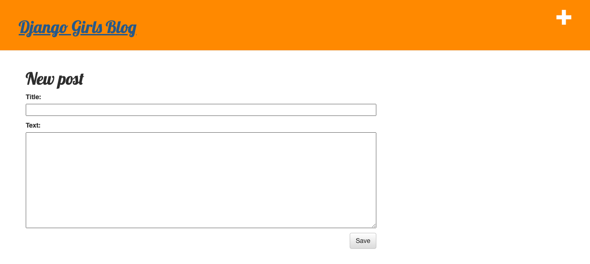

# First time using Django

Implemented a tiny blogging application while going through Django tutorial at [Django Girls](https://djangogirls.org/).



## Clone repository

```shell
git clone https://github.com/samiralibabic/my-first-blog.git django-blog
cd django-blog
```

## Run in Docker container

Update 2023: You can run the project in a Docker container.

### Build Docker image

Make sure Docker is running and:

```shell
docker build -t django-blog .
```

### Run Docker container

```shell
docker run -p 8000:8000 django-blog
```

## Manual install

Update 2023: I added the steps to run the project manually, by installing the required dependencies using Python virtual environment.

### Install Python environment

Install `pyenv` to manage Python versions, as we need an older one for this project:

```shell
brew install pyenv
brew install pyenv-virtualenv
```

Use `pyenv` to install compatible Python version:

```shell
pyenv install 3.5.10
```

Create new Python virtual environment:

```shell
pyenv virtualenv 3.5.10 django-blog
pyenv activate django-blog
```

Install Django 1.9 inside virtual environment:

```shell
pip install Django==1.9
```

### Migrate the database

```shell
python manage.py migrate
```

### Create a superuser

```shell
python manage.py createsuperuser
```

### Run the development server

```shell
python manage.py runserver
```

The project runs on `http://localhost:8000`.
